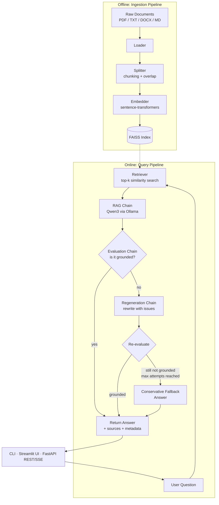

# 🤖 Qwen3 RAG Assistant

[](https://github.com/Kushagra-Kapoor-04/Qwen3-RAG-Assistant/actions/workflows/ci.yml)


A production-style **Retrieval-Augmented Generation (RAG)** assistant that answers questions **only** from your own documents — powered by **Qwen3** (via Ollama) for generation and **FAISS** for vector search. It self-checks every answer for hallucinations and automatically regenerates a more grounded response when needed.

Runs entirely **locally / offline** (no external API keys required) and ships as a **CLI, a Streamlit web app, and a REST API**, containerized with Docker.

---

## Why this project

Most "RAG demos" stop at retrieve → generate. This one adds the part that actually matters in production: **verification**.

```
Question ─▶ Retrieve ─▶ Generate ─▶ Evaluate (grounded?) ─▶ ✅ Return
                                         │
                                         └─ ✗ Not grounded ─▶ Regenerate (up to N tries) ─▶ Return conservative, cited answer
```

If the assistant can't verify its own answer against the retrieved context after several attempts, it **degrades gracefully** to an honest "I don't have enough information" response instead of confidently hallucinating.

---

## ✨ Key Features

- **🛡️ Strict Grounding** — a dedicated evaluation chain checks every answer's claims against the retrieved context and flags unsupported statements.
- **🔄 Auto-Regeneration** — ungrounded answers are automatically rewritten (up to a configurable number of attempts) until they pass grounding, or the assistant honestly says it doesn't know.
- **🔍 Context-Aware Retrieval** — FAISS (`IndexFlatIP`, cosine similarity) + `sentence-transformers` embeddings, with optional MMR-based diversity re-ranking to reduce redundant chunks.
- **⚡ Real-Time Streaming** — token-by-token answers in both the Streamlit UI and the REST API (Server-Sent Events).
- **🌐 Three Interfaces, One Core** — CLI, Streamlit UI, and a FastAPI REST API all sit on top of the same `QueryService`, so the RAG logic is tested once and reused everywhere.
- **📊 Full Observability** — every query logs retrieval time, groundedness verdict, regeneration attempts, and sources used.
- **🐳 One-Command Deploy** — `docker compose up` starts Ollama + the API + the UI together.
- **✅ CI-Tested** — GitHub Actions runs the test suite (unit + API integration tests) and a Docker build on every push.

---

## 🏗️ Architecture



### Project structure

```
├── api/                  # FastAPI REST + streaming (SSE) API
├── app.py                # CLI + Streamlit entry point
├── chains/                # RAG, evaluation (hallucination check), regeneration
├── config/                # Settings, prompts, constants
├── ingestion/             # Document loading, chunking, embedding
├── vectorstore/           # FAISS store + retriever (similarity / MMR)
├── llm/                   # Ollama/Qwen3 client wrapper (sync + streaming)
├── services/              # Query orchestration + structured logging
├── scripts/               # ingest.py, evaluate.py, check_db.py
├── tests/                 # pytest unit + API integration tests
├── Dockerfile / docker-compose.yml
└── .github/workflows/ci.yml
```

---

## 🚀 Quickstart

### Option A — Docker (recommended)

```bash
git clone https://github.com/Kushagra-Kapoor-04/Qwen3-RAG-Assistant.git
cd Qwen3-RAG-Assistant
docker compose up --build
```

This starts:
| Service | URL |
|---|---|
| Ollama (model server) | `http://localhost:11434` |
| REST API + docs | `http://localhost:8000/docs` |
| Streamlit UI | `http://localhost:8501` |

Then pull the model once and ingest your docs (see below).

### Option B — Local

```bash
git clone https://github.com/Kushagra-Kapoor-04/Qwen3-RAG-Assistant.git
cd Qwen3-RAG-Assistant
pip install -r requirements.txt

# Ollama must be installed & running: https://ollama.ai
ollama pull qwen3
```

Create a `.env` (see `.env.example`) to override defaults such as `CHUNK_SIZE`, `TOP_K_RESULTS`, or `OLLAMA_MODEL`.

### 1. Ingest your documents

```bash
# Drop PDFs / .txt / .docx / .md into data/raw/, then:
python scripts/ingest.py --source ./data/raw
```

### 2. Run it

```bash
# CLI
python app.py

# Streamlit UI
python -m streamlit run app.py

# REST API
uvicorn api.main:app --reload --port 8000
```

---

## 🔌 REST API

Interactive docs are auto-generated at `/docs` (Swagger) and `/redoc`.

**Ask a question:**
```bash
curl -X POST http://localhost:8000/query \
  -H "Content-Type: application/json" \
  -d '{"question": "What does the document say about pricing?", "top_k": 5}'
```

```json
{
  "question": "What does the document say about pricing?",
  "answer": "...",
  "sources": ["pricing_sheet.pdf"],
  "is_grounded": true,
  "was_regenerated": false,
  "regeneration_attempts": 0,
  "processing_time_ms": 842.1
}
```

**Stream a response (SSE):**
```bash
curl -N -X POST http://localhost:8000/query/stream \
  -H "Content-Type: application/json" \
  -d '{"question": "Summarize the key findings."}'
```

**Other endpoints:** `GET /health`, `GET /history`, `DELETE /history`.

---

## ⚙️ Configuration

All settings can be overridden via `.env` or environment variables (see `.env.example`):

| Variable | Default | Description |
|---|---|---|
| `OLLAMA_BASE_URL` | `http://localhost:11434` | Ollama server address |
| `OLLAMA_MODEL` | `qwen3:latest` | Generation model |
| `EMBEDDING_MODEL` | `all-MiniLM-L6-v2` | Sentence-transformers embedding model |
| `CHUNK_SIZE` / `CHUNK_OVERLAP` | `500` / `50` | Document chunking |
| `TOP_K_RESULTS` | `5` | Chunks retrieved per query |
| `SIMILARITY_THRESHOLD` | `0.0` | Minimum cosine similarity to keep a chunk |
| `HALLUCINATION_THRESHOLD` | `0.5` | Confidence threshold for grounding failures |
| `MAX_REGENERATION_ATTEMPTS` | `3` | Max rewrite attempts before conservative fallback |

---

## 🧪 Testing

```bash
pytest tests/ -v
```

Covers the evaluation/regeneration grounding logic, prompt templates, retrieval, and the REST API (via `fastapi.testclient`, fully mocked — no live Ollama/FAISS needed in CI).

CI runs this matrix (Python 3.10 & 3.11) plus a Docker build check on every push — see `.github/workflows/ci.yml`.

---

## 🗺️ Roadmap

- [ ] Hybrid retrieval (BM25 + dense) and cross-encoder re-ranking
- [ ] Per-claim citation highlighting in the UI
- [ ] Multi-turn conversational memory with context-aware follow-ups
- [ ] Swap FAISS for a persistent vector DB (Qdrant/pgvector) for multi-user deployments

---

## License

MIT — see [LICENSE](LICENSE).
